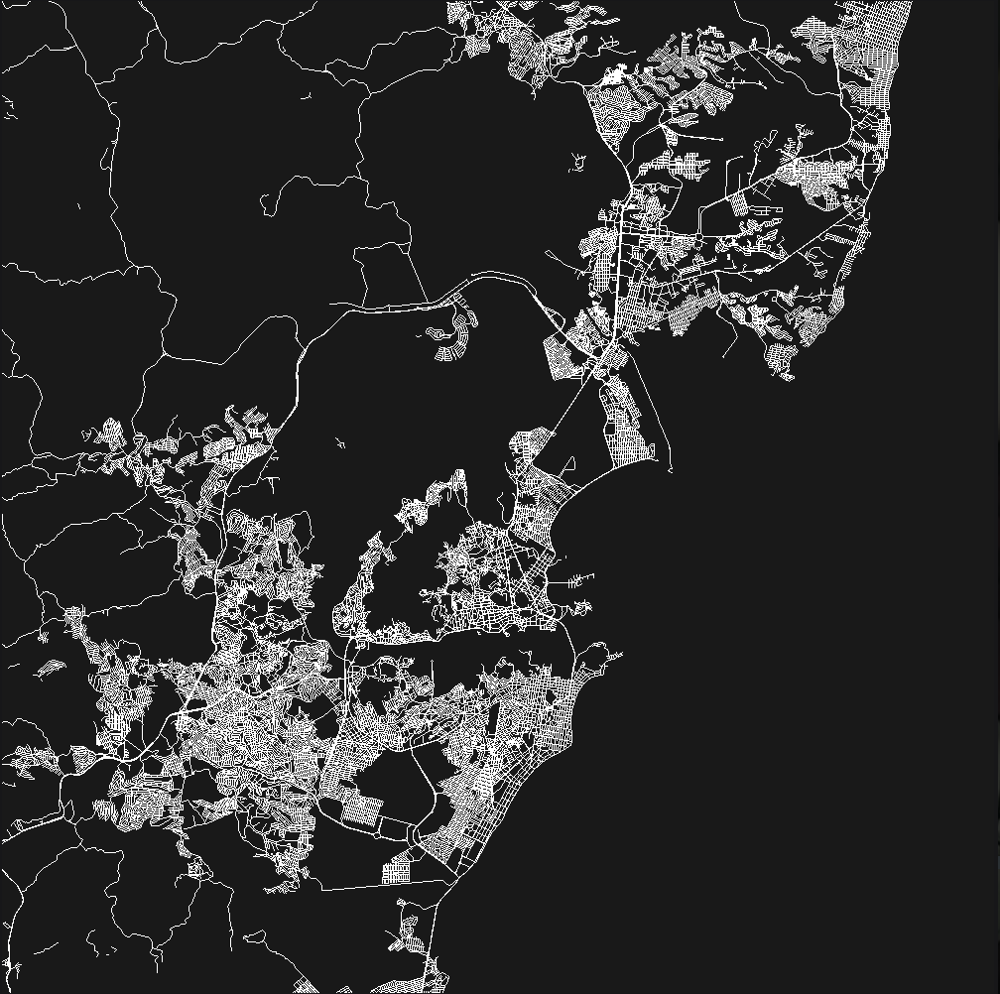

# cartography

A library meant for rendering maps. It does not download or contain any data itself, this is something that is for the user to



## Usage

_Rendering maps_ is a very strong term though. At the moment this lib just takes a bunch of vertices that represent streets and draws them as `GL_LINES`. That is it. But the idea is to extend this quite a bit to make easy templating and offscreen rendering.

You start by loading all vertices that are part of the all the streets you want to render using `map_load_nodes`. There are then three current levels of roads that are supported, and are (should but are not) rendered differently):

* primary roads: `map_load_primary_ways`
* secondary roads: `map_load_secondary_ways`
* tertiary roads: `map_load_tertiary_ways`

Each function takes as parameters an array of node indices (loaded through `map_load_nodes`) and a list of lengths, and last the number of ways that are being loaded (think `glMultiDrawArrays` here).

## Examples

This project is meant to be a library to compile into your own application. There are some examples on how you can create an application in `./examples`. You can run the following make command to compile the example applications:

```sh
make examples
```

This creates two applications but the one that works is `./bin/interactive` which will load some predefined data from openstreetmap and create an interactive application to look at the steets.
